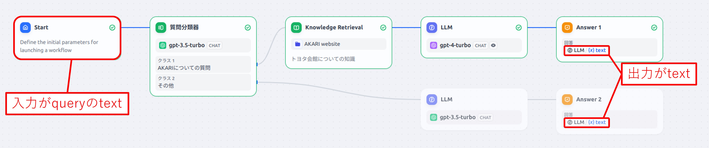

# akari_chat_dify_bot

[AKARIの音声対話bot](https://github.com/AkariGroup/akari_chatgpt_bot)のLLM部分を[Dify](https://dify.ai/)のアプリに置換した対話botです。  

## submoduleの更新
`git submodule update --init --recursive`  

## 仮想環境の作成
`python -m venv venv`  
`source venv/bin/activate`  
`pip install -r requirements.txt`  

## セットアップ方法
[akari_chatgpt_botのREADME](https://github.com/AkariGroup/akari_chatgpt_bot/blob/main/README.md)のセットアップ手順に沿って実行する。  

## Difyのセットアップ

1. [Dify](https://dify.ai/)でアプリを作成し、API keyとBase URLをコピーする。  
   アプリは現状入力がqueryのtext、Answerもテキストのもののみ対応しています。  

1. API keyとBase URLを`config/dify_config.json` に入力する。  

### Difyサンプルの起動方法
キーボード入力した文章に対してDifyアプリ上で返答を作成  
`python3 dify_example.py`  

### 音声対話botの起動方法

1. [akari_chatgpt_botのREADME](https://github.com/AkariGroup/akari_chatgpt_bot/blob/main/README.md)内 **遅延なし音声対話botの実行** の起動方法1., 3.を実行する。  

2. dify_publisherを起動する。(Difyへ文章のリクエストを送信し、受信結果をvoicevox_serverへ渡す。)  
   `python3 dify_publisher.py`  

   引数は下記が使用可能  
   - `--ip`: dify_serverのIPアドレス。デフォルトは"127.0.0.1"  
   - `--port`: dify_serverのポート。デフォルトは"10001"  

3. speech_publisher.pyを起動する。(Google音声認識の結果をgpt_publisherへ渡す。)  
   `python3 speech_publisher.py`  

   引数は下記が使用可能  
   - `--robot_ip`: akari_motion_serverのIPアドレス。デフォルトは"127.0.0.1"
   - `--robot_port`: akari_motion_serverのポート。デフォルトは"50055"
   - `--gpt_ip`: gpt_serverのIPアドレス。デフォルトは"127.0.0.1"
   - `--gpt_port`: gpt_serverのポート。デフォルトは"10001"
   - `--voicevox_ip`: voicevox_serverのIPアドレス。デフォルトは"127.0.0.1"
   - `--voicevox_port`: voicevox_serverのポート。デフォルトは"10002"
   - `-t`,`--timeout`: マイク入力がこの時間しきい値以下になったら音声入力を打ち切る。デフォルトは0.5[s]。短いと応答が早くなるが不安定になりやすい。  
   - `-p`,`--power_threshold`: マイク入力の音量しきい値。デフォルトは0で、0の場合アプリ起動時に周辺環境の音量を取得し、そこから音量しきい値を自動決定する。  
   - `--no_motion`: このオプションをつけた場合、音声入力中のうなずき動作を無効化する。  

4. カメラの画像表示をするウィンドウが起動したら、`speech_publisher.py`のターミナルでEnterキーを押し、マイクに話しかけるとDifyのアプリに基づいた返答が返ってくる。  

### スクリプトで一括起動する方法

1. [akari_chatgpt_botのREADME](https://github.com/AkariGroup/akari_chatgpt_bot/blob/main/README.md)内 **VOICEVOXをOSS版で使いたい場合** の手順を元に、別PCでVoicevoxを起動しておく。  

2. スクリプトを実行する。  

   `cd script`  
   `./dify_chatbot.sh {1.でVoicevoxを起動したPCのIPアドレス}`  
